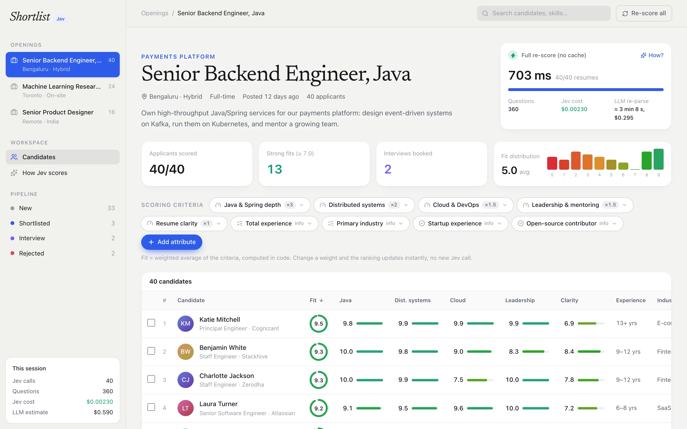
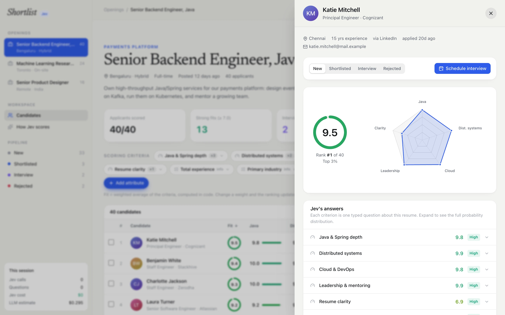
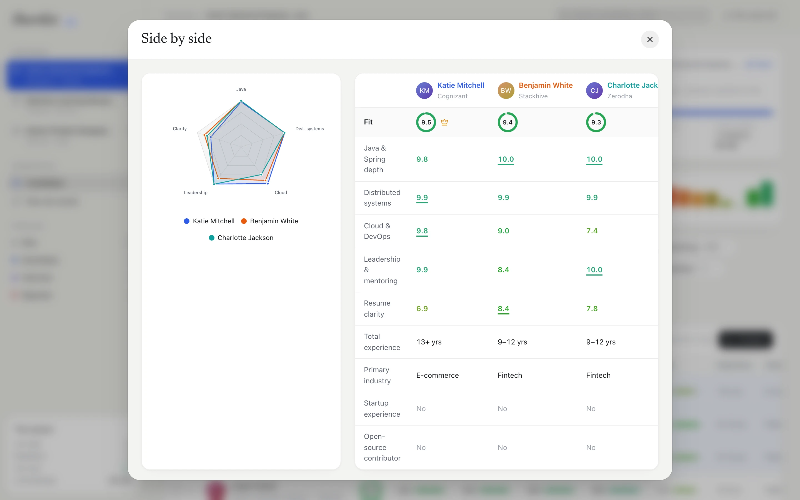
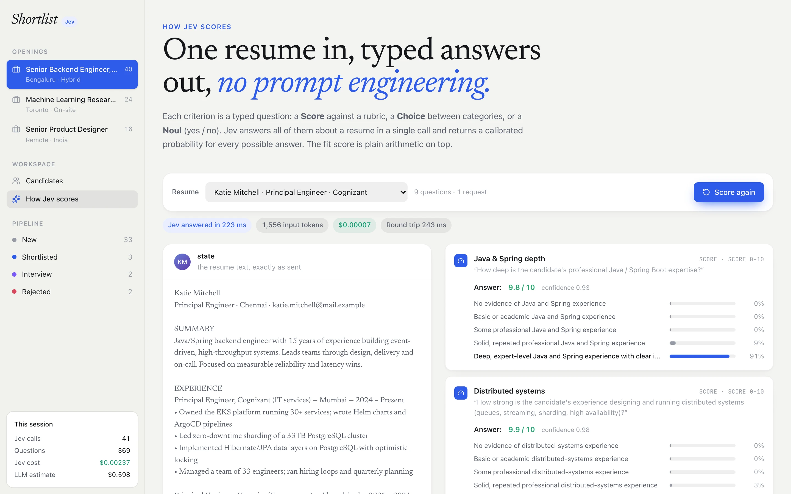

<!-- hero -->
<div align="center">

# Shortlist

**Resume screening with Jev**

Resume screening where every criterion is a typed question. Jev re-scores 40 resumes in under a second when a recruiter adds a new one.

    -7c3aed)



<sub>40 resumes scored on weighted criteria in 703 ms</sub>

</div>

## Screenshots

| | |
|---|---|
|  |  |
| <sub>Candidate profile with Jev's answer for every criterion</sub> | <sub>Side-by-side comparison</sub> |
|  | |
| <sub>How Jev scores: one resume in, typed answers out</sub> | |

## About

An HR screening workspace where every scoring criterion is a typed question that **TypeSafe's Jev** answers about each
resume. Recruiters add criteria on the fly ("Research experience in Canada", "Kafka & event streaming", "Notice period ≤ 30
days") and Jev re-scores the whole batch in well under a second, instead of an LLM re-parsing every resume for minutes.

## Run it

```bash
npm install
cp .env.example .env.local   # add your TYPESAFE_API_KEY
npm run dev                  # http://localhost:3000
```

## What's inside

- **80 synthetic resumes** across three openings: Senior Backend Engineer (40), ML Research Scientist (24), Senior Product
  Designer (16), generated in `src/lib/candidates.ts` from hidden skill levels, so the text (and Jev's scores) vary realistically
- **Candidates table**: fit ring, a 0–10 bar per criterion, experience band, signals, pipeline stage; sortable, searchable, filterable
- **Add attribute**: one-click suggestions per role, or write your own (Score 0–10 with an auto-generated rubric, or Yes/No).
  The new column streams in live and is cached server-side, so only the new question is asked
- **Weights are code**: change a criterion's weight and the ranking re-sorts instantly with no new Jev call (`src/lib/fit.ts`)
- **Candidate drawer**: radar chart, every answer with its full probability distribution and confidence, resume, stage controls
- **Compare** up to three candidates (overlaid radar + table) and **schedule interviews** (mock calendar, nothing is sent)
- **How Jev scores** (`/#how-jev-scores`): score one resume live and watch each answer's distribution appear, see the
  composite-fit arithmetic and the exact request JSON, and race Jev against a projected LLM re-parse across every resume

## How the Jev calls work (`src/lib/score.ts`)

- `state` = the resume text; `questions` = one typed question per criterion (`src/lib/questions.ts`): Score with a rubric,
  Choice for experience band / industry, Noul for yes/no signals
- One request per resume, 24 in flight at once, streamed back to the browser as NDJSON
- Typical numbers: 40 resumes × 9 criteria in ~0.3–0.5 s for ~$0.002; one new criterion on 40 resumes in ~0.2–0.4 s for ~$0.001.
  The LLM baseline (re-parse every resume at $3 / $15 per M tokens, ~75 tok/s, run serially) is shown alongside as an estimate
